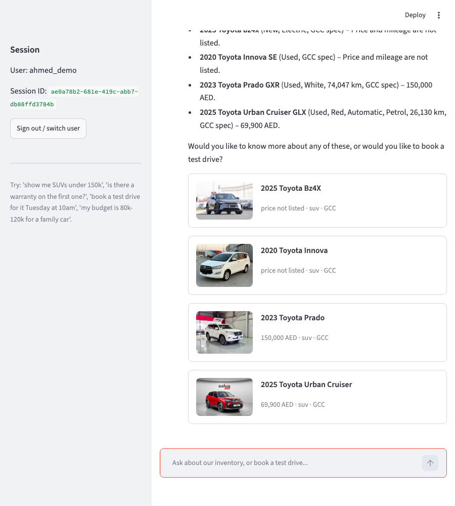
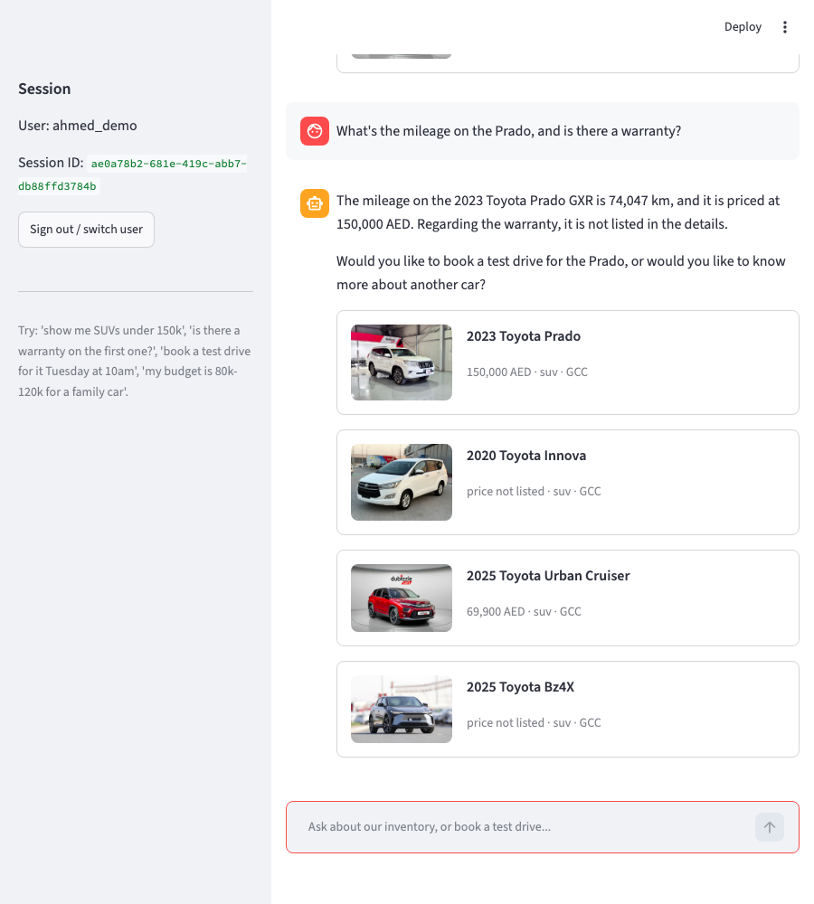
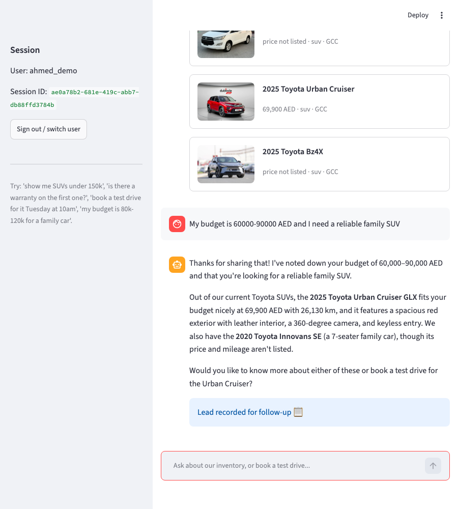
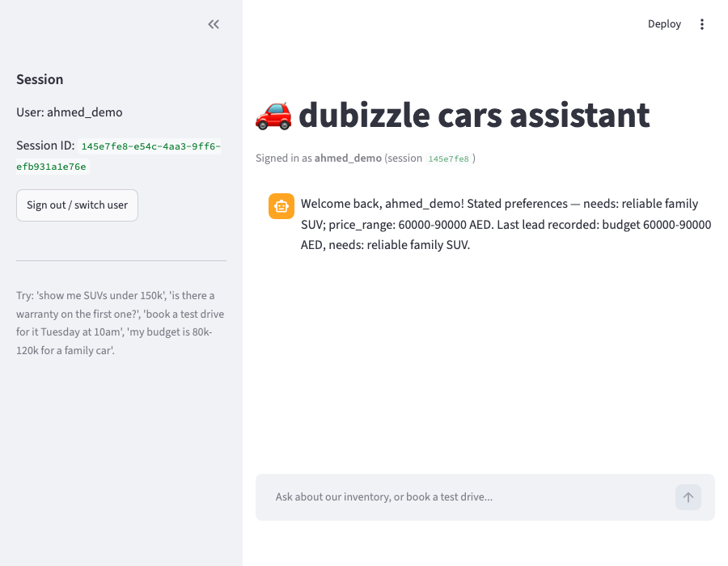

# dubizzle cars AI assistant

A FastAPI backend + Streamlit client that lets a user explore a ~100-listing used-car
inventory, ask follow-up questions, book test-drive slots, get qualified as a lead, and be
recognized across sessions — built for the dubizzle ML Intern take-home.

## Setup

Requires [uv](https://docs.astral.sh/uv/) and Python 3.11+.

```bash
cd project
uv sync

cp .env.example .env
# put your Google AI Studio key in .env:
#   GEMINI_API_KEY=your_key_here
```

**First-time only** — the source spreadsheet has no Price/mileage/body-type columns (see
[Design decisions](#design-decisions) below for why), so a one-time enrichment pass builds
the inventory the app actually reads:

```bash
uv run python scripts/prepare_dataset.py   # ~6 min for 100 rows on the free tier, resumable
```

This writes `data/cars.csv`. The FAISS index (`data/faiss.index`, `data/embeddings.npy`) is
built automatically on first run of the backend and cached to disk after that.

## Run

```bash
# terminal 1 — backend
uv run uvicorn main:app --reload --port 8000

# terminal 2 — client
uv run streamlit run app.py
```

Open the Streamlit URL it prints, enter any name/ID to start (use the same one again in a
new browser session to test cross-session recall), and chat.

Run tests: `uv run pytest tests/ -q` (24 tests, no network calls — pure filter/memory/booking
logic against fixtures). Run the retrieval eval: `uv run python eval/run_eval.py`.

## Why these choices

I chose Streamlit over a notebook for a real chat UI that exercises the backend the way an
actual user would, while keeping all state server-side so the backend stays fully testable on
its own. For the agent, I used an explicit control loop (intent classification → tool routing
→ response) instead of a framework like LangChain, since at this scope it keeps every step a
visible, loggable, unit-testable function rather than hiding logic behind framework
abstractions. For retrieval, I used hybrid pandas filtering + FAISS: structured filters
(price/year/make) are applied first so hard constraints are never violated or hallucinated,
and FAISS then ranks the filtered survivors by semantic similarity — exact/brute-force search
since ~100 rows doesn't need an approximate index. Memory uses SQLite for both short-term
(session messages, summarized past 12 turns) and long-term (preferences, leads, bookings) —
simple, inspectable, and a drop-in swap to Postgres if this went to production.

## Design decisions

The dataset had no structured Price/mileage/body-type fields — those values lived
inconsistently inside scraped description text. A one-time enrichment script extracts them
via LLM function-calling only when explicitly stated in the source text (never inferred), so
retrieval and grounding stay honest about what's actually known, at the cost of ~31% price
coverage — handled by retrieval's filter-relaxation fallback. Guardrails route out-of-scope/
competitor questions to fixed canned replies rather than trusting the LLM to freeform-refuse
correctly.

Out of scope: real authentication (a typed name/ID is trusted as-is), a real payments/CRM
integration for leads (simulated via SQLite + CSV), Arabic/RTL translation, and booking
slot-conflict prevention (only the Mon–Sat 8am–8pm window was required). A next step would be
merging the per-turn intent-classification and filter-extraction LLM calls into one to reduce
latency and free-tier rate-limit pressure.

## Evaluation

`eval/golden_set.json` has 18 hand-labeled queries across four categories; `eval/run_eval.py`
scores each independently of response generation (pure retrieval function in, car IDs out)
and writes `eval/results.json`. Latest run:

```
Structured/multi-turn (n=10): P@5=1.00  R@5=1.00  MRR=1.00
Semantic (n=5): avg LLM-judge relevance = 4.00/5
No-match fallback (n=3): 3/3 correctly relaxed/broadened search
Grounding check (n=4): 4/4 responses fully grounded in shown cars
```

- **Structured/multi-turn** (exact make/model/price/year lookups, incl. filters carried
  across turns): precision/recall/MRR against hand-verified car IDs.
- **Semantic** (queries with no single correct answer, e.g. "something rugged for desert
  driving"): scored 1–5 by a separate cheap Gemini call acting as judge.
- **No-match** (queries with no valid inventory match): checks the system relaxed filters or
  fell back to full-corpus search rather than returning nothing or erroring.
- **Grounding**: for a sample of real generated replies, every make+model mentioned in the
  text is checked against the cars actually shown that turn (deterministic regex check, no
  LLM judge) — flags a real, in-corpus car being described out of context, i.e. the
  hallucination pattern the structured pre-filter is meant to prevent.

Every LLM call (data-prep enrichment, filter extraction, intent classification, booking/lead
extraction, response generation) is logged to `data/traces.db` with latency and token counts.
A sample, filtered to real (non-retried) calls:

```
component               n     median   typical avg
filter_extraction       150   997ms    1026ms
intent_classification   42    914ms    905ms
response_generation     38    1358ms   1307ms
```

```
2026-09-15T20:15:25  response_generation    gemini/gemini-3.5-flash-lite  1143.9ms  prompt=1344 completion=164
2026-09-15T20:15:23  lead_extraction        gemini/gemini-3.5-flash-lite   913.8ms  prompt=589  completion=45
2026-09-15T20:15:22  intent_classification  gemini/gemini-3.5-flash-lite   701.2ms  prompt=538  completion=18
2026-09-15T20:15:19  filter_extraction      gemini/gemini-3.5-flash-lite   926.9ms  prompt=408  completion=58
```

## Screenshots

**Multi-turn conversation** — inventory search, then a follow-up ("is there a warranty on
it?") resolved via short-term memory without restating the car, then lead qualification:





**Cross-session recall** — a brand-new session (new session ID) for the same returning user,
greeted with their preferences and last lead recalled from a previous session:


